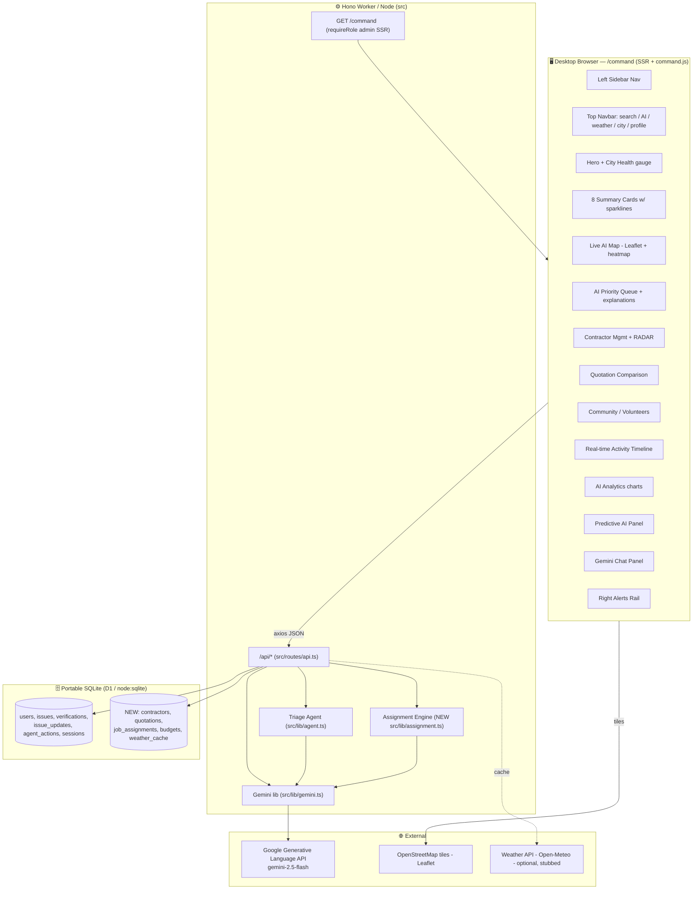
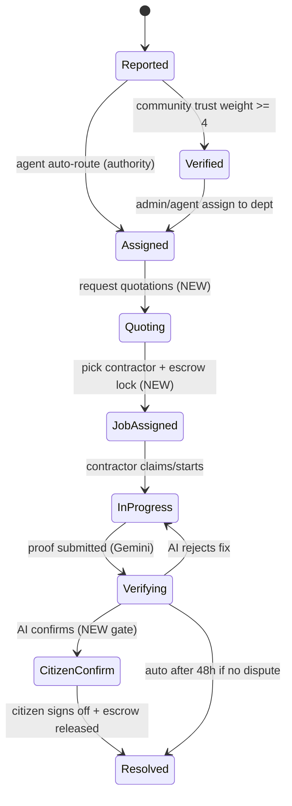

# Design Document: Municipal AI Command Center

## Overview

The **Municipal AI Command Center** is the upgraded Municipal Official (admin) panel for the existing
**TrustLens AI** civic platform. Where today's `/admin` page is a compact, mobile-styled operations
dashboard, the Command Center is a **desktop-first, full-screen control room**: a persistent left
sidebar, a global top navbar, a hero with a City Health Score, live AI map, an AI Priority Queue with
per-row explanations, smart contractor management with a "RADAR" for nearby contractors, quotation
comparison, community/volunteers, a real-time activity timeline, AI analytics, predictive insights, an
embedded Gemini chat, and a right-hand alerts rail.

The central thesis the user asked us to make explicit is **"how it integrates with municipal for the
assignment of tasks."** The Command Center is the human-in-the-loop cockpit on top of the existing
autonomous triage agent. The agent (`src/lib/agent.ts`) already runs `perceive → reason → dedupe →
prioritize → route → plan` on every new report and auto-assigns to a department authority. The Command
Center adds the **next stage of the lifecycle the brief describes** — recommending responders, requesting
quotations, the Commissioner assigning a job with an escrow hold, job execution with before/after proof,
AI verification, citizen confirmation, and payment/closure — and surfaces all of it visually.

This design is built to fit the **current portable stack** with no rewrites: Hono + TypeScript JSX SSR on
Cloudflare Pages/Workers (with the `node:sqlite` adapter for Cloud Run), the D1 SQL API
(`db.prepare(sql).bind(...).first()/all()/run()`), TailwindCSS via CDN, Leaflet/OpenStreetMap (no Google
Maps billing), Chart.js, and the existing Gemini library. It reuses `requireRole('admin')`, the existing
`/api/*` endpoints, and the existing data model, adding only the missing pieces (a new `/command` route,
migrations `0009+`, and a small set of new endpoints). It also reconciles the brief's color system
(`#2563EB / #10B981 / #F59E0B / #EF4444`, 20px radius, glassmorphism) with the app's current Material-3
tokens (`#003d9b` …) via a **scoped theme** that does not touch the mobile citizen app.

---

## PART A — HIGH-LEVEL DESIGN

## Architecture



**Rendering approach (desktop vs mobile).** The citizen app (`/home`, `/report`, `/map`, …) is
mobile-first: it uses `TopBar` + `BottomNav` and a `max-w-2xl/3xl` centered column. The Command Center is
a **separate desktop layout** rendered by a new route `GET /command`. It does **not** use `BottomNav`; it
uses a fixed left sidebar (`w-[260px]`) + fixed top navbar (`h-[64px]`) + a fluid main grid
(`max-w-[1600px]`), and is gated behind `requireRole('admin')` server-side (redirect to `/login` /
`/authority` / `/contractor` exactly like the current `/admin`). All data still arrives via the existing
`/api/*` JSON endpoints through `axios` and the shared `window.CH` helpers, so the two front-ends share one
backend. `/admin` is kept as a fallback/redirect to `/command` so existing links keep working.

---

## Components and Interfaces

This section maps each UI region to its backing component/endpoint. The TypeScript interfaces for the new
backend modules (`Contractor`, `Quote`, `RankedContractor`, etc.) are defined in **Data Models** below and
implemented in `src/lib/assignment.ts`. The desktop shell is composed of these components:

- **`CommandShell`** (SSR, `src/index.tsx`): the `/command` desktop layout — left sidebar + top navbar +
  main region grid + right alerts rail. Interface: server-rendered JSX, guarded by `requireRole('admin')`.
- **`command.js`** (client): the controller that fetches each region via `axios`, renders cards/tables/
  charts, drives the Leaflet map, and wires Assign / Quote / RADAR actions. Interface: `window.CH` helpers.
- **`assignment.ts`** (server lib): `rankContractors()` and `scoreQuotations()` — the deterministic
  recommendation + value-score engine (see Data Models + algorithm sections).
- **`geo.ts`** (server lib): `haversineMeters()` extracted from `api.ts`, used by RADAR.
- **Region → data-source table** below enumerates every region's component and its API contract.

### Region → data source


Each region maps to an existing endpoint where possible; **NEW** marks gaps specified in Part B.

| # | UI Region | Primary data source | Status |
|---|-----------|--------------------|--------|
| 1 | Left Sidebar (nav, profile, dark-mode) | static + `/api/auth/me` | reuse |
| 2 | Top Navbar — global search | `GET /api/issues` (client filter) + **`GET /api/search`** | partial / NEW |
| 2 | Top Navbar — weather + city | **`GET /api/weather`** (Open-Meteo or stub) | NEW |
| 2 | Top Navbar — AI Assistant button | opens Chat panel → `POST /api/chat` | reuse |
| 3 | Hero — City Health Score + insight | `GET /api/city-health` | reuse |
| 4 | Summary Cards (8) w/ sparklines + %Δ | **`GET /api/command/summary`** (extends `/api/stats`) | NEW (wraps existing) |
| 5 | Live AI Map (colored pins, heatmap) | `GET /api/issues` (has `lat/lng/severity/status`) | reuse |
| 6 | AI Priority Queue + per-row explanation | `GET /api/issues?verify=true` + `GET /api/issues/:id/agent` | reuse |
| 6 | Queue "Assign" action | **`POST /api/issues/:id/assign-job`** (new lifecycle) + existing `/assign` | NEW + reuse |
| 7 | Smart Contractor Management cards | **`GET /api/contractors`** | NEW |
| 7 | RADAR — nearby contractors | **`GET /api/contractors/nearby?lat&lng`** (Haversine) | NEW |
| 8 | Quotation Comparison (3 quotes + AI score) | **`GET /api/issues/:id/quotations`** + **`POST …/quotations/request`** | NEW |
| 9 | Community / Volunteers | `GET /api/leaderboard` + **`GET /api/volunteers/nearby`** | partial / NEW |
| 10 | Real-time Activity Timeline | `GET /api/agent/activity` + **`GET /api/activity`** (cross-issue updates) | partial / NEW |
| 11 | AI Analytics (7 charts) | `GET /api/stats` + **`GET /api/analytics`** (trends, resolution time) | partial / NEW |
| 12 | Predictive AI Panel | `GET /api/predict` | reuse |
| 13 | Gemini Chat Panel + canned Qs | `POST /api/chat` (extend system prompt for admin) | reuse |
| 14 | Right Alerts Rail (emergencies, weather, high-risk, budget, approvals) | composite of `/api/issues`, `/api/weather`, **`/api/budgets`**, **`/api/command/approvals`** | partial / NEW |
| — | Departments view | `GET /api/authorities` + **`GET /api/departments`** (with load/perf) | partial / NEW |
| — | Budget & Quotations module | **`GET /api/budgets`**, `/api/quotations` | NEW |
| — | Reports / weekly report | `GET /api/insight` + **`GET /api/reports/weekly`** | partial / NEW |

---

## Data Flow — The Task-Assignment Lifecycle (the core integration)

The brief's 10-step Civic Issue Resolution Flow maps onto existing + new pieces as follows. Steps 1–4 and
7–10 largely **exist**; the Command Center adds steps **5 and 6** (recommend responders + quotations +
escrow assignment) and visualizes the whole chain.

```mermaid
sequenceDiagram
    participant Cit as Citizen (mobile app)
    participant Agent as Triage Agent
    participant Gem as Gemini
    participant CC as Command Center (Commissioner)
    participant Con as Contractor
    participant Esc as Escrow (job_assignments)

    Note over Cit,Agent: STEP 1-2 (EXISTS)
    Cit->>Agent: POST /api/issues (photo + desc)
    Agent->>Gem: analyzeIssue + agentReason
    Gem-->>Agent: category, severity, priority, department
    Agent->>Agent: dedupe → prioritize → route → plan

    Note over CC: STEP 3 Admin Review (EXISTS, upgraded)
    CC->>CC: AI Priority Queue w/ explanation row

    Note over CC,Con: STEP 4-5 Recommend Responders (NEW)
    CC->>Con: GET /api/contractors/nearby (RADAR, Haversine)
    CC->>Gem: recommendContractors() → ranked + reason

    Note over CC,Con: STEP 6 Quotation (NEW)
    CC->>Con: POST /api/issues/:id/quotations/request
    Con-->>CC: quotes (cost, time, rating)
    CC->>Gem: scoreQuotations() → AI value score + best pick

    Note over CC,Esc: STEP 6b Assign Job + escrow (NEW)
    CC->>Esc: POST /api/issues/:id/assign-job (lock budget)
    Esc-->>Con: job assigned, status → Assigned/In Progress

    Note over Con,Gem: STEP 7-8 Execute + Verify (EXISTS)
    Con->>CC: POST /api/issues/:id/proof (after photo)
    CC->>Gem: verifyFix(before, after)
    Gem-->>Esc: resolved? confidence

    Note over Cit,Esc: STEP 9-10 Confirm + Pay (EXISTS + NEW confirm)
    Cit->>CC: POST /api/issues/:id/confirm (citizen sign-off, NEW)
    Esc->>Con: release escrow → earnings; status → Resolved
```

**Assignment state machine** (extends the existing `issues.status`):



> Implementation note: to avoid breaking existing screens that read `status`, the new sub-states
> (`Quoting`, `JobAssigned`, `Verifying`, `CitizenConfirm`) are tracked on the **new `job_assignments`
> table** via its own `state` column, while `issues.status` continues to use the canonical set
> (`Reported → Verified → Assigned → In Progress → Resolved`). The Command Center derives the richer view
> by joining `issues` with `job_assignments`.

---

## How Gemini Powers Each AI Region

All calls go through `src/lib/gemini.ts`, which always has a deterministic heuristic fallback (works with
no API key). Existing functions are reused; new ones follow the same `{ ..., source: 'gemini'|'heuristic' }`
pattern.

| AI Region | Function | New? |
|-----------|----------|------|
| Priority Queue explanation ("Critical because…") | `agentReason()` `priority_reason` (already stored in `agent_actions`) | reuse |
| City Health insight line | `generateCityHealthInsight()` | reuse |
| Predictive AI Panel | `predictTrends()` | reuse |
| Chat panel | `chatReply()` (extend system prompt with admin context) | reuse |
| Contractor recommendation ("Suggested by Gemini") | **`recommendContractors()`** | NEW |
| Quotation AI value score + best proposal | **`scoreQuotations()`** | NEW |
| Weekly report generation | `generateInsight()` + **`generateWeeklyReport()`** | partial / NEW |
| Before/after fix verification | `verifyFix()` | reuse |

---

## PART B — LOW-LEVEL DESIGN

## Gap Analysis — What Already Exists vs What's NEW

**Reuse as-is (no backend change):** City Health gauge, summary stats, AI Priority Queue, agent activity
feed, issue table + assign-to-authority, category/status charts, predictions, chat, before/after proof
verification, leaderboard, notifications, Leaflet map data (`lat/lng/severity/status` are on every issue).

**NEW pieces required:**

1. **Contractors directory + RADAR** — contractors today are just `users` with `role='contractor'` and no
   profile (no lat/lng, skills, rating, company, availability). Need a `contractors` profile table + nearby
   search via Haversine (the formula already exists inline in `api.ts` as `haversineMeters`; extract to
   `src/lib/geo.ts`).
2. **Quotations** — no table or comparison logic exists. Need `quotations` + AI value-score ranking.
3. **Job assignment + escrow lifecycle** — the contractor loop exists (`claim` → `proof` → `bounty`) but
   there's no Commissioner-driven "assign this contractor with an escrow hold" step. Need `job_assignments`.
4. **Budgets** — no budget data. Need a `budgets` table (seeded/simulated figures, clearly labelled).
5. **Weather / emergencies / high-risk zones widgets** — weather needs an external API or a documented
   stub; emergencies & high-risk zones are **derived** from existing issues (no new data needed).
6. **Departments view** — derivable from `users` (authorities) + issue aggregates; add a convenience
   endpoint.
7. **Volunteers/community** — partly covered by `leaderboard`; add nearby-volunteers + verification-rate.
8. **Weekly report generation** — extend `generateInsight()`.
9. **Citizen confirmation step** — new endpoint to close the loop (`/confirm`).
10. **Desktop glassmorphism theme + dark mode** — scoped CSS, no change to mobile tokens.

---

## Data Models

The data layer has two parts: **(1) new SQL tables** (migration `0009`, the persistent model) and
**(2) TypeScript interfaces** used by the recommendation/scoring engine. Both are listed here.

### TypeScript interfaces (`src/lib/assignment.ts`)

```ts
interface ContractorRow {
  user_id: number; name: string; company?: string
  rating: number;            // 0.0 - 5.0
  active_tasks: number;      // current open jobs
  jobs_completed: number;
  availability: 'available' | 'busy' | 'offline';
  skills: string[];          // e.g. ["Pothole", "Water Leak"]
  lat: number | null; lng: number | null;
}

interface RankedContractor extends ContractorRow {
  distance_km: number | null;
  match_score: number;       // 0..100 deterministic ranking
  ai_recommendation?: string; ai_source?: 'gemini' | 'heuristic';
}

interface Quote {
  contractor_id: number; name: string;
  est_cost: number;          // INR, > 0
  est_days: number;          // > 0
  past_rating: number;       // [0,5]
}

interface ScoredQuote extends Quote {
  ai_value_score: number;    // 0..100
  recommended: boolean;      // exactly one true per set
  ai_reason?: string;
}

interface JobAssignment {
  id: number; issue_id: number; contractor_id: number | null;
  quotation_id: number | null; assigned_by: number | null;
  escrow_amount: number; escrow_status: 'locked' | 'released' | 'refunded';
  state: 'JobAssigned' | 'InProgress' | 'Verifying' | 'CitizenConfirm' | 'Resolved' | 'Cancelled';
  citizen_confirmed: 0 | 1;
}
```

**Validation rules:** `rating ∈ [0,5]`; `availability ∈ {available,busy,offline}`; `est_cost > 0`,
`est_days > 0`, `past_rating ∈ [0,5]`; `escrow_amount >= 0`; an issue has **at most one**
`job_assignments` row with `state != 'Cancelled'` (see Property 1); `issues.status` is restricted to the
canonical set `{Reported, Verified, Assigned, In Progress, Resolved}`.

### Persistent model — Migration `0009_command_center.sql`


```sql
-- 0009_command_center.sql — Municipal AI Command Center
-- Adds contractor profiles, quotations, escrow-style job assignments,
-- department/ward budgets, and a small weather cache. Additive only:
-- existing tables and the canonical issues.status set are untouched.

-- ── Contractor profiles (1:1 with users where role='contractor') ──────────
CREATE TABLE IF NOT EXISTS contractors (
  user_id        INTEGER PRIMARY KEY REFERENCES users(id),
  company        TEXT,
  skills         TEXT,                       -- CSV or JSON: "Pothole,Water Leak"
  rating         REAL    NOT NULL DEFAULT 4.0,   -- 0.0 - 5.0
  jobs_completed INTEGER NOT NULL DEFAULT 0,
  availability   TEXT    NOT NULL DEFAULT 'available', -- available | busy | offline
  active_tasks   INTEGER NOT NULL DEFAULT 0,
  lat            REAL,
  lng            REAL,
  base_address   TEXT,
  photo_url      TEXT,
  created_at     DATETIME DEFAULT CURRENT_TIMESTAMP
);
CREATE INDEX IF NOT EXISTS idx_contractors_avail ON contractors(availability);

-- ── Quotations (multiple per issue, one per contractor) ───────────────────
CREATE TABLE IF NOT EXISTS quotations (
  id              INTEGER PRIMARY KEY AUTOINCREMENT,
  issue_id        INTEGER NOT NULL REFERENCES issues(id),
  contractor_id   INTEGER NOT NULL REFERENCES users(id),
  est_cost        INTEGER NOT NULL,           -- INR
  est_days        REAL    NOT NULL,           -- completion time in days
  past_rating     REAL    NOT NULL DEFAULT 4.0,
  ai_value_score  REAL,                       -- 0-100, computed by scoreQuotations()
  ai_reason       TEXT,
  recommended     INTEGER NOT NULL DEFAULT 0, -- 1 = Gemini's best pick
  status          TEXT    NOT NULL DEFAULT 'submitted', -- submitted | accepted | rejected
  created_at      DATETIME DEFAULT CURRENT_TIMESTAMP,
  UNIQUE(issue_id, contractor_id)
);
CREATE INDEX IF NOT EXISTS idx_quotations_issue ON quotations(issue_id);

-- ── Job assignments — the escrow-backed lifecycle the Command Center drives ─
CREATE TABLE IF NOT EXISTS job_assignments (
  id              INTEGER PRIMARY KEY AUTOINCREMENT,
  issue_id        INTEGER NOT NULL REFERENCES issues(id),
  contractor_id   INTEGER REFERENCES users(id),
  quotation_id    INTEGER REFERENCES quotations(id),
  assigned_by     INTEGER REFERENCES users(id),   -- the admin who assigned
  escrow_amount   INTEGER NOT NULL DEFAULT 0,      -- locked on assign
  escrow_status   TEXT    NOT NULL DEFAULT 'locked', -- locked | released | refunded
  state           TEXT    NOT NULL DEFAULT 'JobAssigned',
                  -- JobAssigned | InProgress | Verifying | CitizenConfirm | Resolved | Cancelled
  citizen_confirmed INTEGER NOT NULL DEFAULT 0,
  created_at      DATETIME DEFAULT CURRENT_TIMESTAMP,
  updated_at      DATETIME DEFAULT CURRENT_TIMESTAMP
);
CREATE INDEX IF NOT EXISTS idx_jobassign_issue ON job_assignments(issue_id);
CREATE INDEX IF NOT EXISTS idx_jobassign_contractor ON job_assignments(contractor_id);

-- ── Budgets — per department/ward (figures are SEEDED/SIMULATED for demo) ──
CREATE TABLE IF NOT EXISTS budgets (
  id            INTEGER PRIMARY KEY AUTOINCREMENT,
  department    TEXT NOT NULL,
  fiscal_year   TEXT NOT NULL DEFAULT '2024-25',
  allocated     INTEGER NOT NULL DEFAULT 0,   -- INR
  spent         INTEGER NOT NULL DEFAULT 0,   -- INR (sum of released escrow)
  committed     INTEGER NOT NULL DEFAULT 0,   -- INR (locked escrow not yet released)
  UNIQUE(department, fiscal_year)
);

-- ── Weather cache (optional external API; stub-friendly) ───────────────────
CREATE TABLE IF NOT EXISTS weather_cache (
  city        TEXT PRIMARY KEY,
  payload     TEXT NOT NULL,                  -- JSON blob
  fetched_at  DATETIME DEFAULT CURRENT_TIMESTAMP
);
```

**Seed additions — `0009_seed.sql`** (demo data so the panel is populated immediately; clearly labelled
as simulated where real sources are unavailable):

```sql
-- Promote the existing contractor (user 20) to a full profile + add two more.
INSERT OR IGNORE INTO users (id, name, email, role, password_hash) VALUES
  (21, 'RoadCare Infra', 'roadcare@city.gov', 'contractor', '<pbkdf2-hash>'),
  (22, 'AquaFix Services', 'aquafix@city.gov', 'contractor', '<pbkdf2-hash>');

INSERT OR IGNORE INTO contractors (user_id, company, skills, rating, jobs_completed, availability, active_tasks, lat, lng, base_address) VALUES
  (20, 'FixIt Civic Works', 'Pothole,Graffiti,Other', 4.6, 128, 'available', 2, 30.7410, 76.7820, 'Sector 17, Chandigarh'),
  (21, 'RoadCare Infra',     'Pothole,Water Leak',     4.8, 96,  'available', 1, 30.7280, 76.7600, 'Sector 35, Chandigarh'),
  (22, 'AquaFix Services',   'Water Leak,Streetlight', 4.3, 54,  'busy',      4, 30.7490, 76.7980, 'Sector 8, Chandigarh');

-- Simulated departmental budgets (FY 2024-25, INR).
INSERT OR IGNORE INTO budgets (department, allocated, spent, committed) VALUES
  ('Road Maintenance', 5000000, 1850000, 320000),
  ('Sanitation',       3000000, 1200000, 0),
  ('Electrical',       2000000,  640000, 80000),
  ('Water Works',      4000000, 2100000, 150000),
  ('Parks & Recreation', 1500000, 410000, 0);
```

---

## New Endpoint Signatures + Example Responses

All new endpoints mount under the existing `api` Hono app in `src/routes/api.ts` and use
`requireRole('admin')` unless noted. Contractor-facing ones (submit quote) use `requireRole('contractor')`.

### Contractors directory + RADAR

```ts
// GET /api/contractors  → all contractor profiles, joined to users.
//   Query: ?skill=Pothole&availability=available
api.get('/contractors', requireRole('admin'), handler)

// GET /api/contractors/nearby?lat=30.74&lng=76.78&skill=Pothole&radius_km=10
//   RADAR: contractors within radius, sorted by distance then rating.
api.get('/contractors/nearby', requireRole('admin'), handler)
```

```jsonc
// GET /api/contractors/nearby?lat=30.7415&lng=76.7822&skill=Pothole
{
  "origin": { "lat": 30.7415, "lng": 76.7822 },
  "contractors": [
    {
      "user_id": 20, "name": "FixIt Civic Works", "company": "FixIt Civic Works",
      "skills": ["Pothole", "Graffiti", "Other"], "rating": 4.6, "jobs_completed": 128,
      "availability": "available", "active_tasks": 2,
      "distance_km": 0.4, "photo_url": null,
      "ai_recommendation": "Suggested by Gemini: closest available crew with a 4.6★ pothole record.",
      "ai_source": "gemini"
    },
    { "user_id": 21, "name": "RoadCare Infra", "distance_km": 2.6, "rating": 4.8, "...": "..." }
  ]
}
```

### Quotations

```ts
// POST /api/issues/:id/quotations/request  → asks N nearby contractors to quote
//   body: { contractor_ids: number[] }  → seeds 'submitted' quotation stubs / notifies
// POST /api/issues/:id/quotations         → a contractor submits a quote (role: contractor)
//   body: { est_cost, est_days, past_rating? }
// GET  /api/issues/:id/quotations         → all quotes + AI value scores + best pick
api.get('/issues/:id/quotations', requireRole('admin'), handler)
```

```jsonc
// GET /api/issues/1/quotations
{
  "issue_id": 1,
  "quotes": [
    { "contractor_id": 20, "name": "FixIt Civic Works", "est_cost": 18000, "est_days": 1.5,
      "past_rating": 4.6, "ai_value_score": 91.2, "recommended": true,
      "ai_reason": "Best value: lowest cost-per-rating with fastest turnaround." },
    { "contractor_id": 21, "name": "RoadCare Infra", "est_cost": 16000, "est_days": 3.0,
      "past_rating": 4.8, "ai_value_score": 86.4, "recommended": false,
      "ai_reason": "Cheapest and highest-rated but slower completion." },
    { "contractor_id": 22, "name": "AquaFix Services", "est_cost": 24000, "est_days": 2.0,
      "past_rating": 4.3, "ai_value_score": 71.0, "recommended": false,
      "ai_reason": "Higher cost with a lower rating reduces value." }
  ],
  "best_quotation_id": 5,
  "ai_source": "gemini"
}
```

### Job assignment (escrow) + citizen confirmation

```ts
// POST /api/issues/:id/assign-job  → Commissioner assigns a contractor, locks escrow.
//   body: { contractor_id, quotation_id }
//   effect: create job_assignments(state='JobAssigned', escrow_status='locked'),
//           set issues.contractor_id, status='Assigned', budgets.committed += amount,
//           write issue_updates timeline row.
api.post('/issues/:id/assign-job', requireRole('admin'), handler)

// POST /api/issues/:id/confirm  → citizen sign-off closes the loop (Firebase citizen).
//   effect: job_assignments.citizen_confirmed=1, escrow released → contractor earnings,
//           budgets.spent += amount, budgets.committed -= amount, status='Resolved'.
api.post('/issues/:id/confirm', handler /* requireCitizen */)
```

```jsonc
// POST /api/issues/1/assign-job  { "contractor_id": 20, "quotation_id": 5 }
{
  "ok": true, "job_id": 7, "issue_id": 1, "contractor_id": 20,
  "escrow_amount": 18000, "escrow_status": "locked",
  "state": "JobAssigned", "issue_status": "Assigned"
}
```

### Summary cards, analytics, departments, budgets, approvals, weather, activity

```ts
api.get('/command/summary',   requireRole('admin'), h) // 8 cards: value, %Δ vs prior period, 7-pt sparkline
api.get('/analytics',         requireRole('admin'), h) // category, dept perf, monthly trend, resolution time, satisfaction, heatmap buckets
api.get('/departments',       requireRole('admin'), h) // authorities + open/resolved counts + avg resolution + budget
api.get('/budgets',           requireRole('admin'), h) // per-dept allocated/spent/committed/utilization%
api.get('/command/approvals', requireRole('admin'), h) // pending contractor approvals + quotations awaiting decision
api.get('/volunteers/nearby', requireRole('admin'), h) // top citizens by score + verification rate
api.get('/reports/weekly',    requireRole('admin'), h) // Gemini weekly report (generateWeeklyReport)
api.get('/weather',           requireRole('admin'), h) // Open-Meteo (no key) cached in weather_cache; stub fallback
api.get('/activity',          requireRole('admin'), h) // recent issue_updates across all issues (the timeline)
api.get('/search',            requireRole('admin'), h) // global search across issues/contractors/departments
```

```jsonc
// GET /api/command/summary  (each card carries value, delta %, and a sparkline series)
{
  "cards": {
    "total_reports":        { "value": 1284, "delta_pct": 4.2,  "spark": [11,14,9,17,13,20,18] },
    "open_issues":          { "value": 173,  "delta_pct": -3.1, "spark": [40,38,36,35,33,30,29] },
    "critical_issues":      { "value": 12,   "delta_pct": 9.0,  "spark": [2,1,3,2,4,3,5] },
    "resolved_today":       { "value": 38,   "delta_pct": 12.0, "spark": [5,6,4,7,6,9,8] },
    "avg_resolution_hours": { "value": 18.4, "delta_pct": -6.5, "spark": [24,23,21,20,19,19,18] },
    "citizen_satisfaction": { "value": 92,   "delta_pct": 1.5,  "spark": [88,89,90,90,91,91,92], "unit": "%" },
    "budget_utilized":      { "value": 47,   "delta_pct": 2.0,  "spark": [40,41,43,44,45,46,47], "unit": "%" },
    "pending_approvals":    { "value": 6,    "delta_pct": 0.0,  "spark": [4,5,6,5,6,7,6] }
  },
  "note": "avg_resolution_hours and citizen_satisfaction are derived; budget figures are simulated seed data."
}
```

```jsonc
// GET /api/weather?city=Chandigarh   (Open-Meteo: free, no key, no billing)
{ "city": "Chandigarh", "temp_c": 31, "condition": "Partly cloudy", "icon": "partly_cloudy_day",
  "rain_prob_pct": 60, "alert": "Rain likely after 6 PM — road-damage risk rises.",
  "source": "open-meteo", "cached_at": "2024-06-01T12:00:00Z" }
// Fallback when offline / API fails:
{ "city": "Chandigarh", "temp_c": null, "condition": "Unavailable", "source": "stub" }
```

---

## The Contractor-Recommendation + Quotation AI-Value-Score Algorithm

New module **`src/lib/assignment.ts`** (pure, deterministic core + optional Gemini narration). The numeric
scoring is deterministic so it is testable and works with no API key; Gemini only adds the human-readable
`ai_reason`/`ai_recommendation` text.

### Contractor recommendation (RADAR ranking)

```ts
// src/lib/assignment.ts
import { haversineMeters } from './geo' // extracted from api.ts

export interface ContractorRow {
  user_id: number; name: string; rating: number; active_tasks: number
  availability: 'available' | 'busy' | 'offline'
  skills: string[]; lat: number | null; lng: number | null
}

export interface RankedContractor extends ContractorRow {
  distance_km: number | null
  match_score: number // 0..100, deterministic
}

/**
 * Rank contractors for an issue. Higher is better.
 * Preconditions:  issue has category; lat/lng may be null (distance term drops to neutral).
 * Postconditions: result is sorted by match_score desc; offline contractors excluded;
 *                 every returned contractor has skill-match OR is the only option.
 */
export function rankContractors(
  issue: { category: string; lat: number | null; lng: number | null },
  contractors: ContractorRow[]
): RankedContractor[] {
  const MAX_DIST_KM = 25
  return contractors
    .filter((c) => c.availability !== 'offline')
    .map((c) => {
      const distM = (issue.lat != null && c.lat != null)
        ? haversineMeters(issue.lat, issue.lng!, c.lat, c.lng!) : null
      const distKm = distM == null ? null : distM / 1000

      // Component scores (each 0..1):
      const skill   = c.skills.includes(issue.category) ? 1 : 0.3
      const prox    = distKm == null ? 0.6 : Math.max(0, 1 - distKm / MAX_DIST_KM)
      const quality = Math.min(1, c.rating / 5)
      const load    = c.availability === 'available'
                        ? Math.max(0, 1 - c.active_tasks / 8) : 0.2

      // Weights: skill 0.35, proximity 0.25, quality 0.25, availability/load 0.15
      const match = 100 * (0.35 * skill + 0.25 * prox + 0.25 * quality + 0.15 * load)
      return { ...c, distance_km: distKm == null ? null : Math.round(distKm * 10) / 10,
               match_score: Math.round(match * 10) / 10 }
    })
    .sort((a, b) => b.match_score - a.match_score)
}
```

### Quotation AI value score

```ts
export interface Quote {
  contractor_id: number; name: string
  est_cost: number; est_days: number; past_rating: number
}
export interface ScoredQuote extends Quote { ai_value_score: number; recommended: boolean }

/**
 * Value = quality per unit cost per unit time. Normalized across the quote set to 0..100.
 * Preconditions:  quotes.length >= 1; est_cost > 0; est_days > 0; past_rating in [0,5].
 * Postconditions: exactly one quote has recommended=true (the max score; ties → lowest cost);
 *                 every score in [0,100]; ordering by raw value is preserved by the scores.
 */
export function scoreQuotations(quotes: Quote[]): { scored: ScoredQuote[]; bestId: number } {
  // Raw value: rating rewarded; cost & time penalized (log-damped so outliers don't dominate).
  const raw = quotes.map((q) => {
    const quality = q.past_rating / 5                     // 0..1
    const costTerm = 1 / Math.log10(q.est_cost + 10)      // cheaper → higher
    const timeTerm = 1 / Math.log10(q.est_days * 10 + 10) // faster → higher
    return quality * (0.6 * costTerm + 0.4 * timeTerm)
  })
  const min = Math.min(...raw), max = Math.max(...raw)
  const norm = (v: number) => max === min ? 100 : Math.round(((v - min) / (max - min)) * 100 * 10) / 10

  const scored = quotes.map((q, i) => ({ ...q, ai_value_score: norm(raw[i]), recommended: false }))
  // Best = highest score; tie-break by lowest cost.
  let best = 0
  for (let i = 1; i < scored.length; i++) {
    if (scored[i].ai_value_score > scored[best].ai_value_score ||
       (scored[i].ai_value_score === scored[best].ai_value_score &&
        scored[i].est_cost < scored[best].est_cost)) best = i
  }
  scored[best].recommended = true
  return { scored, bestId: scored[best].contractor_id }
}
```

### Gemini narration (optional layer in `src/lib/gemini.ts`)

```ts
// recommendContractors(apiKey, issue, rankedTop3) → { reason: string, source }
// scoreQuotations narration: scoreQuotationsReason(apiKey, issue, scoredQuotes) → text
// Both follow the existing pattern: try Gemini, catch → deterministic sentence fallback.
```

---

## Algorithmic Pseudocode — Assign-Job (escrow) handler

```pascal
ALGORITHM assignJob(issueId, contractorId, quotationId, adminUser)
INPUT:  issueId, contractorId, quotationId, adminUser (role=admin)
OUTPUT: job_assignments row + updated issue + budget

BEGIN
  ASSERT adminUser.role = 'admin'                       // requireRole('admin')

  issue ← DB.issues WHERE id = issueId
  IF issue = NULL THEN RETURN 404

  quote ← DB.quotations WHERE id = quotationId AND issue_id = issueId AND contractor_id = contractorId
  IF quote = NULL THEN RETURN 400 "quotation does not match issue/contractor"

  existing ← DB.job_assignments WHERE issue_id = issueId AND state != 'Cancelled'
  IF existing != NULL THEN RETURN 409 "issue already has an active assignment"

  escrow ← quote.est_cost

  // Atomic-ish sequence (D1 has no multi-statement txn in Workers; order writes so a
  // partial failure leaves a safe state — create assignment first, then derived updates).
  job ← INSERT job_assignments (issue_id, contractor_id, quotation_id, assigned_by,
                                escrow_amount=escrow, escrow_status='locked',
                                state='JobAssigned')
  UPDATE quotations SET status='accepted' WHERE id = quotationId
  UPDATE quotations SET status='rejected' WHERE issue_id = issueId AND id != quotationId
  UPDATE issues SET contractor_id = contractorId, status = 'Assigned',
                    updated_at = NOW WHERE id = issueId
  UPDATE budgets SET committed = committed + escrow WHERE department = issue.department
  INSERT issue_updates (issue_id, status='Assigned', department=issue.department,
                        message='Job assigned to <name>; escrow ₹<escrow> locked.',
                        author=adminUser.name)

  RETURN { job_id: job.id, escrow_amount: escrow, escrow_status: 'locked', state: 'JobAssigned' }
END
```

```pascal
ALGORITHM confirmAndPay(issueId, citizen)
PRECONDITION:  job in state 'Verifying' or 'CitizenConfirm' (fix already AI-verified)
POSTCONDITION: escrow released exactly once; budgets.spent += escrow; committed -= escrow;
               issue.status = 'Resolved'; contractor.earnings += escrow

BEGIN
  job ← DB.job_assignments WHERE issue_id = issueId AND escrow_status = 'locked'
  IF job = NULL THEN RETURN 409 "no locked escrow for this issue"

  UPDATE job_assignments SET citizen_confirmed = 1, escrow_status = 'released',
                             state = 'Resolved', updated_at = NOW WHERE id = job.id
  UPDATE users   SET earnings = earnings + job.escrow_amount WHERE id = job.contractor_id
  UPDATE budgets SET spent = spent + job.escrow_amount,
                     committed = MAX(0, committed - job.escrow_amount)
                 WHERE department = (SELECT department FROM issues WHERE id = issueId)
  UPDATE issues  SET status = 'Resolved', updated_at = NOW WHERE id = issueId
  INSERT issue_updates (issue_id, status='Resolved', message='Citizen confirmed; ₹<amt> released.', author=citizen.name)
  RETURN { ok: true, released: job.escrow_amount }
END
```

---

## Frontend — `/command` route + `public/static/command.js`

- **New SSR route** `app.get('/command', …)` in `src/index.tsx`: server-side `requireRole('admin')` guard
  (same pattern as `/admin`), renders the desktop shell (sidebar + navbar + region containers with
  element IDs). Keep `/admin` working by redirecting it to `/command` (or leaving it as the legacy view).
- **New page script** `public/static/command.js` (vanilla JS, reuses `window.CH` from `common.js`):
  fetches each region via `axios`, renders cards/tables/charts, polls every ~6s like `admin.js`,
  initializes Leaflet with colored pins + a heatmap layer, and wires the Assign / Quote / RADAR actions.
- **Charts**: Chart.js (already loaded). **Map**: Leaflet + OpenStreetMap tiles (already loaded). Heatmap
  via `leaflet.heat` (small CDN add) or a manual circle-marker density layer to avoid new deps.
- **Glassmorphism + micro-animations + skeletons**: added to `public/static/style.css` under a scoped
  `.cc-scope` class so the mobile app is untouched.

### Pin color legend (matches brief)

```
Red    #EF4444  Critical (severity >= 5, unresolved)
Orange #F59E0B  High     (severity 4)
Yellow #FACC15  Medium   (severity 3)
Green  #10B981  Resolved
Purple #8B5CF6  Volunteer tasks
```

---

## Color / Theme Reconciliation

The brief specifies `#2563EB` (royal blue), `#10B981` (emerald), `#F59E0B` (amber), `#EF4444` (red),
~20px radius, glassmorphism. The app's current Material-3 tokens are `primary #003d9b`, `secondary
#006c47`, etc., defined in `src/renderer.tsx`'s `tailwindConfig`.

**Approach: a scoped Command-Center theme — do not change the global tokens** (that would alter the mobile
citizen app's look). Implemented as CSS variables under a wrapper class applied only on `/command`:

```css
/* public/static/style.css — appended, scoped */
.cc-scope {
  --cc-primary:   #2563EB;
  --cc-secondary: #10B981;
  --cc-accent:    #F59E0B;
  --cc-error:     #EF4444;
  --cc-radius:    20px;
  --cc-bg:        #F8FAFC;
}
.cc-scope .cc-card {
  border-radius: var(--cc-radius);
  background: rgba(255,255,255,0.7);
  backdrop-filter: blur(12px) saturate(140%);
  border: 1px solid rgba(255,255,255,0.5);
  box-shadow: 0 8px 32px rgba(2,6,23,0.06);
}
.cc-scope.dark { --cc-bg:#0B1220; /* dark-mode glass variables */ }
```

Tailwind utility classes still work; brand-specific colors are applied via these variables / inline styles
on the `/command` page only. The mobile app keeps `#003d9b`. (The PWA `<meta theme-color>` stays `#003d9b`.)

---

## Error Handling

| Scenario | Response | Recovery |
|----------|----------|----------|
| Non-admin hits `/command` | server redirect to `/login`/`/authority`/`/contractor` | same as `/admin` today |
| API 401 mid-session (expired cookie) | `command.js` redirects to `/login` | re-login |
| Gemini call fails / no key | endpoints return deterministic heuristic with `source:'heuristic'` | UI shows a subtle "heuristic" chip; no crash |
| Weather API unreachable | `/api/weather` returns `source:'stub'` payload | widget shows "Unavailable", no error |
| Assign-job on an issue with an active assignment | `409` | UI shows "already assigned" toast, refreshes |
| Quotation request with no nearby contractors | `200` empty list + message | UI prompts to widen RADAR radius |
| Confirm/pay called twice (double release) | escrow guarded by `escrow_status='locked'` filter → `409` second time | idempotent: paid exactly once |
| Map tiles fail to load | Leaflet shows grey grid | pins still render from data; retry on pan |

---

## Testing Strategy

**Unit tests** (Vitest — add to repo; it isn't configured yet):
- `geo.haversineMeters` against known coordinate pairs.
- `rankContractors`: skill match dominates; offline excluded; null coords → neutral proximity; sorted desc.
- `scoreQuotations`: exactly one `recommended`; scores in `[0,100]`; tie-break by lowest cost; ordering
  preserves raw value ranking.

**Property-based tests** (library: **fast-check**, matching the TS/JS stack):
- For any non-empty list of valid quotes, `scoreQuotations` returns exactly one recommended quote and all
  scores ∈ [0,100].
- For any contractor list, `rankContractors` output is sorted non-increasing by `match_score` and excludes
  `offline`.
- `assignJob` then `confirmAndPay` releases escrow exactly once: total `spent` increases by exactly
  `escrow_amount` regardless of repeated confirm calls (idempotency).
- Budget invariant: `committed >= 0` and `spent + committed <= allocated` is never violated by the
  assign/confirm/cancel transitions (for seeded allocations large enough to cover).

**Integration tests**: full lifecycle on a seeded issue — request quotes → score → assign-job (escrow
locked, committed up) → proof (`verifyFix` heuristic) → confirm (escrow released, spent up, status
Resolved), asserting `issue_updates` timeline rows at each step.

## Correctness Properties

### Property 1: Single active assignment
∀ issue, at most one `job_assignments` row exists with `state != 'Cancelled'`.

### Property 2: Escrow paid once
∀ job, the transition `locked → released` happens at most once; contractor `earnings` increases by
exactly the locked `escrow_amount`. Repeated `confirm` calls are idempotent.

### Property 3: Budget conservation
∀ department, after any assign/confirm/cancel sequence, `committed >= 0` and `spent` is monotonically
non-decreasing.

### Property 4: Best quote is recommended
`scoreQuotations` marks exactly one quote `recommended`, and it has the maximum `ai_value_score` (ties
broken by lowest `est_cost`).

### Property 5: RADAR ordering
`rankContractors` results are sorted non-increasing by `match_score`, contain no `offline` contractors,
and `distance_km` is null iff either endpoint lacks coordinates.

### Property 6: Status compatibility
The canonical `issues.status` value is never set outside `{Reported, Verified, Assigned, In Progress,
Resolved}`; richer sub-states live only in `job_assignments.state`.

### Property 7: Authorization
Every `/api/command/*`, `/contractors*`, `/quotations` (admin), `/assign-job`, `/budgets`, `/analytics`,
and `/departments` endpoint rejects non-admin sessions with 401/403.


## Performance Considerations

- Summary/analytics endpoints should aggregate in **single SQL passes** (the existing `/stats` already
  batches with `Promise.all` — follow that pattern); avoid N+1 across issues.
- The page polls every ~6s (matching `admin.js`); heavy payloads (`video_data`, base64 photos) are already
  excluded from list endpoints — keep that for the map and queue.
- Weather is cached in `weather_cache` (refresh ≥ 15 min) to avoid hammering the external API.
- Sparkline series are small (7 points) and computed server-side from daily buckets.

## Security Considerations

- All Command Center data + mutations are behind `requireRole('admin')` (session cookie, PBKDF2). Citizen
  confirm uses the Firebase-backed `requireCitizen`.
- The Command Center is an **authenticated internal surface** — no new unauthenticated endpoints are
  introduced. The global search must parameterize all queries (`.bind(...)`) — no string interpolation.
- Escrow/budget mutations are admin-only and guarded by state checks (Property 1 / Property 2) to prevent double-spend.
- Treat any external weather payload as untrusted: validate/whitelist fields before storing/rendering.

## Dependencies

**Existing (reused):** Hono, hono/jsx, TailwindCSS (CDN), Chart.js (CDN), Leaflet + OpenStreetMap (CDN),
axios (CDN), Material Symbols, the D1/`node:sqlite` portable layer, `src/lib/gemini.ts`, `src/lib/agent.ts`,
`src/lib/auth.ts`, `src/lib/firebase.ts`.

**New:**
- `leaflet.heat` (small CDN script) for the heatmap overlay — *optional*; a manual density layer avoids it.
- **Open-Meteo** free weather API (no key, no billing) for the weather widget, cached in `weather_cache`;
  fully degradable to a stub.
- `src/lib/geo.ts` (extracted Haversine) and `src/lib/assignment.ts` (ranking + scoring) — new internal
  modules, no external deps.
- **fast-check** + **Vitest** as devDependencies for the property/unit tests.

**Explicitly NOT added:** Google Maps (billing) — Leaflet/OSM is used throughout. Google Maps remains an
optional future swap if a billed key is provided.

---

## Honesty Notes (real vs simulated data)

- **Real / derived from existing data:** total reports, open/critical/resolved counts, city health,
  priority queue + AI explanations, predictions, map pins, agent activity, leaderboard, before/after fix
  verification, contractor earnings.
- **Simulated / seeded (clearly labelled in UI):** department budgets and budget-utilization %, contractor
  ratings/`jobs_completed`/availability beyond what the loop produces, citizen-satisfaction %, and
  avg-resolution-time until enough resolved-issue timestamps accumulate.
- **External + degradable:** weather (Open-Meteo; falls back to a stub). High-risk zones and "today's
  emergencies" are **derived** (clustering high-severity unresolved issues by address/ward), not external.

---

## Branding

Google AI Studio / Gemini branding is surfaced via the "Suggested by Gemini" chips on contractor
recommendations and quotation picks, and the AI Assistant panel, consistent with the existing TrustLens AI
logo (`/static/logo.svg`) and tagline "See. Verify. Solve."
